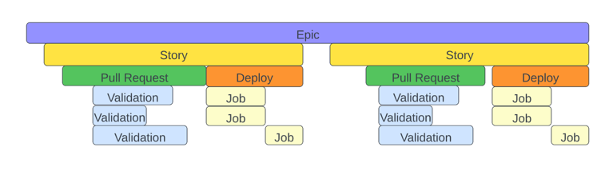

# flow-telemetry
Adding observability to feature flow with OpenTelemetry.

More and more companies rely on software as a competitive advantage, allowing them to serve their customers better,
understand and optimize their business, improve their operations, and so on. But building software is not the same
as building physical objects. There is no factory floor where you can see what is going on. It is also not a repeatable
process where every widget is built in exactly the same way with the same parts. 

Seminal books like Accelerate and From Product to Project have shown us what we need to measure to observe and improve
the flow of software delivery. Many organization are building tools to help them measure and visualize how their 
software is being built, and some companies are starting to provide platforms that delivery some of this tooling. But
what we're lacking is a shared, open-source framework for software delivery observability.

OpenTelemetry has allowed the software community to build an ecosystem of tools and libraries for observability of
software systems. It helps us answer questions like questions like "why is it taking so long to render the page?" and 
"what happened that caused this significant increase in latency?" 

But these are the same questions have for feature delivery. Just like we want to improve and maintain latency and 
throughput as we scale our software, we want to maintain and improve the speed and throughput of our feature delivery
as we scale our organization.

This project is a space where we as a community can start adding OpenTelemetry observability into feature delivery, 
allowing us to have the same rich ecosystem of dashboards, tools and libraries for digging deep into how we are
building software that we currently have for observing software systems.

## Conceptual mapping
OpenTelemetry models everything as Signals. There are three types of signals: traces, logs, and metrics. 
Let's look at how those concepts apply when we are looking at feature flow rather than software system flow.

### Tracing
In order for us to understand how our software delivery systems are behaving and where the hidden bottlenecks are,
we need to trace the flow of a feature through our systems, from concept to delivery. This maps to an 
[OpenTelemetry Trace](https://opentelemetry.io/docs/concepts/observability-primer/#distributed-traces). 

For example, for many companies a JIRA Epic for many companies maps to a new feature. This becomes our Root Span.
Each story under the epic represents a new span under the epic. A pull request in github would start a new span.  
Jobs that are run as part of PR validation would be spans under the PR span.

The commit kicks off a CI/CD pipeline and each job under the pipeline is a new span.  Each step in a job, such as
building the software, running unit tests, and publishing results, is a new span under that job.

Imagine if you could use OpenTelemetry dashboards to view the overall cycle time of feature delivery, and then drill
into a specific feature and see where the time was being spent, or being able to run OpenTelemetry queries to understand
patterns of behavior across a series of features.  This observability would be so powerful, and you would be able to
take advantage of all the visualization and querying products and tools that are out there in the OpenTelemetry
ecosystem.

### Events 
Events capture data about the system at a specific moment in time. For example, you can have events that
tell you when a JIRA item changed state, when a comment was added to a ticket, when somebody was assigned,
when a change was committed in github, and so on.

In OpenTelemetry, events are modeled as a [specific type of log](https://opentelemetry.io/docs/concepts/signals/logs/)

### Metrics
OpenTelemetry defines a metric as _a measurement about a service, captured at runtime_

In the feature flow world, a "service" is some tool or process we are using in support of delivering a feature. 
"Runtime" means, as the feature is being built and delivered.

Some examples of very metrics around feature flow we might want to deliver to the OpenTelemetry collector:
- Number of comments on a pull request or a JIRA ticket
- How many times a ticket was marked as blocked
- The number of times a build job was retried
- How much memory was used to compile a project
- Code coverage for a test run

## Open Telemetry for the win!
As you can see, Open Telemetry is a great fit for how we model and observe feature flow in our software delivery
pipeline. By taking advantage of this well-established model and community, we can start gaining deep, powerful and
actionable insights into what is going on as we are building features.

When we combine this with the science, math, and concepts behind Lean, Continuous Delivery, Accelerate, and the 
Flow Framework, we can much more readily understand what to focus on and what to improve, so that our efforts to
optimize and improve feature delivery are effective and based on real, visible data.

## Installation

- Install node and npm
- Run `npm install`

## Usage
The service is currently hardcoded to talk to a local Jaeger instance.  You can run Jaeger locally by
running `tools/run-local-jaegar.sh`.

If you would like it to talk to a different OpenTelemetry collector, you can create a provider under
`github/opentelemetry` and in `index.js` provide that provider when you create the `GithubEventProcessor`

One thing we would like to do is make the collector configurable, but that is not yet implemented.

Once you have Jaeger running, you can start the service by running `npm start`

## Contributing
Pull requests are welcome. For major changes, please open an issue first to discuss what you would like to change.

Please make sure to update tests as appropriate.

## License
[Apache 2.0](https://www.apache.org/licenses/LICENSE-2.0)